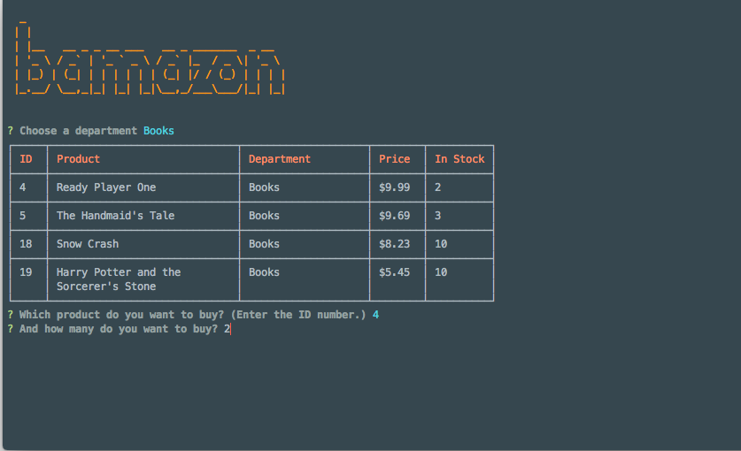
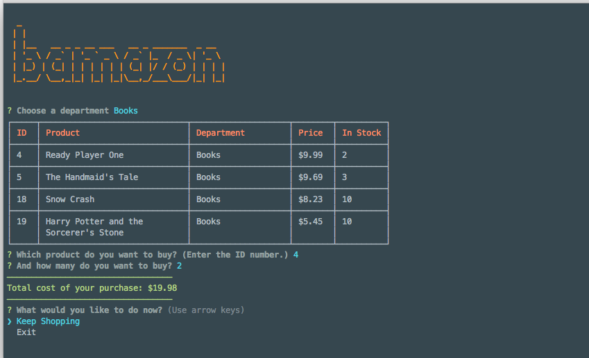

# Bamazon

<strong>Bamazon</strong>
---
Premium CLI shopping experience
Browsers. Mice. Graphical user interfaces. Bah!

Who needs 'em!?

Bamazon™ is a streamlined, minimalist shopping experience that leverages the most powerful interface on the planet: the mother-grabbin' command line.

Sure, it's cumbersome. And yeah, you can't actually see what you're going to buy. But hey — check out those sexy tables!

<strong>Features</strong>
---
-shop by department
-choose from dozens of products (okay, maybe a single dozen)
-input validation
-purchase quantity validation
-total cost calculation

<strong>Screenshots</strong>
---

